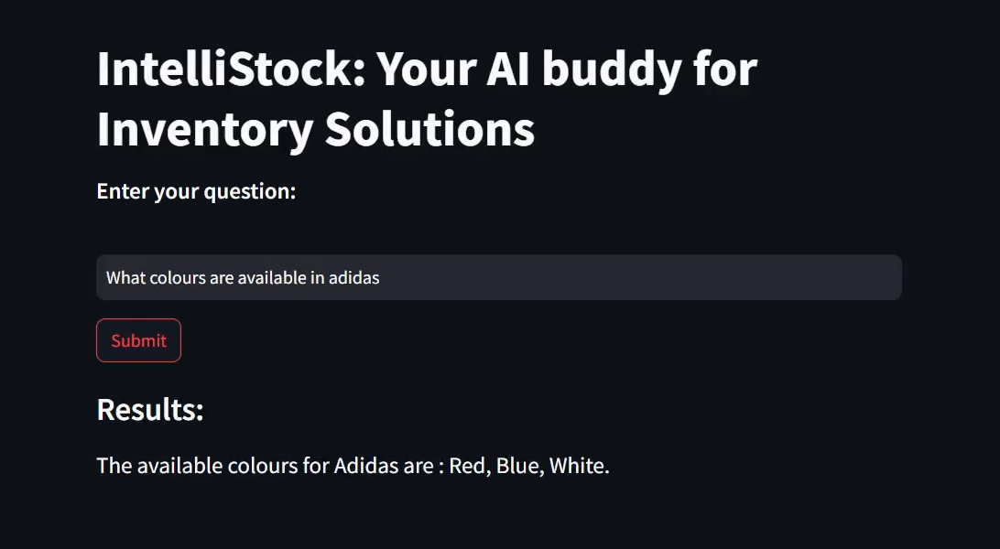

# IntelliStock

IntelliStock is a friendly tool that translates everyday questions about inventory into database queries. It fetches data from a SQLite database and presents the answers in plain, easy-to-understand text. This makes it simple for anyone to get detailed inventory information without needing to interpret complex numbers or technical terms.



## Features
- Converts natural language questions to SQL queries.
- Retrieves data from a SQLite database.
- Displays results in a Streamlit application.
- Presents query results in a clear and understandable text format, providing human-readable interpretations rather than raw numerical data.

## Installation
1. Clone the repository:
   ```bash
   git clone https://github.com/adarshnair.04/IntelliStock.git
   cd IntelliStock
   ```

2. Create and activate a virtual environment:
   ```bash
   python -m venv venv
   source venv/bin/activate  # On Windows use `venv\Scripts\activate`
   ```

3. Install the required packages:
   ```bash
   pip install -r requirements.txt
   ```
4. Acquire an api key through makersuite.google.com

5. For database setup, run sql.py in your IDE.

## Usage
1. Set up environment variables by creating a `.env` file and adding your Google API key:
   ```env
   GOOGLE_API_KEY=your_google_api_key
   ```

2. Run the Streamlit application:
   ```bash
   streamlit run app.py
   ```
   The web app will open in your browser where you can ask questions

## Code Explanation
- `get_gemini_response(question, prompt)`: Function to get responses from Google Gemini Model.
- `read_sql_query(sql, db)`: Function to execute SQL queries on the SQLite database.
- Streamlit app setup to get user input and display results.

## Sample Questions
1. How many brands are available?
2. How much is the price of Reebok?
3. What colours are available in Adidas?
4. How much stock is left in gap?
5. What is the total stock price of Nike?
6. What is the total stock quantity of t-shirts?

## Project Structure
- app.py: The main Streamlit application script.
- .env: Configuration file for storing your Google API key.
- requirements.txt: A list of required Python packages for the project.
- sql.py: Contains SQLite database operations and schema for managing inventory data of t-shirts.

## License
This project is licensed under the MIT License - see the [LICENSE] file for details.